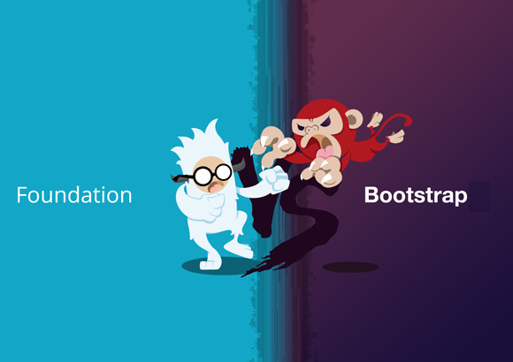

<!--

WARNING!! DON'T EDIT THE FILE README.md on the root of the project, that one is a GENERATED FILE!

You should just edit the source file at src/README.md - the one which stars with ## The good war for UI

-->

## The good war for UI

Henrique Filho @ [Avenue Code](http://www.avenuecode.com)

*hfilho@avenuecode.com*

Feb 24th, 2014

---

## Agenda

 - Just CSS Frameworks?
 - Bootstrap Overview
 - Foundation Zurb Overview
 - Examples
  - Grids
  - Thumbnails
  - Carousels
  - Bars
  - Responsive
  - Features

----

## Agenda

 - Right library for the project
  - Structure
  - LESS X SASS
  - Rems and Pixels
  - Comunity
  - Old and Cross Browsers
  - Advantages and Disavantages
 - Learn more
 - Conclusion
 - Assignment

---

## Prerequisites

- CSS Intermediate
- JS Basic
- HTML Basic

---

## Just CSS Frameworks?

- *Why to use CSS frameworks?*
 - Productivity
 - Responsive pages
 - Plugins
 - Features
- *Why they are not just CSS Frameworks?*
 - JS features (modals, alerts etc)
 - CSS extension languages (LESS and SASS)
 - Comunity support on JS/HTML/CSS

----

## Just CSS Frameworks?

- Why *not* to use CSS frameworks?
 - Heavy
   - *Be aware* of what you are using
   - Several customization may be required
 - *All pages looks like the same*
 - Easy to copy
   - Poor Security

---

## Bootstrap Overview

- *Bootstrap*: The most popular front-end framework for developing responsive, mobile first projects on the web.
 - Released on August 2011
 - Built by Twitter team, and shared all over the world
 - LESS since beginning
 - Bootstrap your application in a few minutes
 - Huge community

----

## Bootstrap Overview

- Latest Release: *Bootstrap 3* (January 30, 2014)
 - SASS compatible
 - Single fluid grid with classes for phones, tablets, desktops, and large desktop devices
 - All styles have been optimized for performance.
 - Dropped IE7 support

----

## Foundation Zurb Overview

- *Foundation Zurb*: The most advanced responsive front-end framework in the world.
 - Released on September 2011
 - Built by the ZURB team (Designer company http://zurb.com)
 - SASS since beginning
 - Organize your CSS code to built great apps

----

## Foundation Zurb Overview

- Latest Release: *Foundation Zurb 5* (November 21, 2013)
 - Performance improvements and developer tools
 - jQuery 2 instead of Zepto
 - New templates
 - Libsass to improve compilation performance

---

## Examples - Grids

- [Bootstrap Grid](http://getbootstrap.com/examples/grid/)
- [Foundation Grid](http://foundation.zurb.com/grid-1.html)

----

## Thumbnails

- [Bootstrap Thumbnail](http://getbootstrap.com/components/#thumbnails)
- [Foundation Thumbnail](http://foundation.zurb.com/docs/components/thumbnails.html)

----

## Carousels

- Bootstrap
 - [Carousels](http://getbootstrap.com/examples/carousel/)
- Foundation
 - [Orbit](http://foundation.zurb.com/docs/components/orbit.html)

----

## Bars

- Bootstrap
 - [Nav Bars](http://getbootstrap.com/components/#navbar)
 - [Progress Bars](http://getbootstrap.com/components/#progress)

- Foundation
 - [Top Bars](http://foundation.zurb.com/docs/components/topbar.html)
 - [Progress Bars](http://foundation.zurb.com/docs/components/progress_bars.html)

----

## Responsive

- [Bootstrap Reponsive Utilities](http://getbootstrap.com/css/#responsive-utilities)
- [Off Canvas (Only on Foundation)](http://foundation.zurb.com/docs/components/offcanvas.html)

----

## Features

- Modals
 - [Bootstrap Modals](http://getbootstrap.com/javascript/#modals)
 - [Foundation Reveals](http://foundation.zurb.com/docs/components/reveal.html)
- Tooltips
 - [Bootstrap tooltips](http://getbootstrap.com/javascript/#tooltips)
 - [Foundation tooltips](http://foundation.zurb.com/docs/components/tooltips.html)
- Clearing
 - [Only on Foundation](http://foundation.zurb.com/docs/components/clearing.html)

---

## Right library for the project
  - Structure
    - Both structures are simmilary: Install using *bower*, run with *grunt*, use *SASS*, *JS* codes and more
  - LESS X SASS
   - Bootstrap uses LESS and now SASS is compatible. Foundation uses *only* SASS(advanced with Libsass)
  - *Mobile First VS Mobile Also*
   - Foundation was made to be built on Mobile First
   - Bootstrap has made to be built on Desktop and will

----

## Right library for the project

  - *Old and Cross Browsers*
   - Bootstrap is compatible with more older browsers than Foundation
   - Foundation uses more things on new browsers
   - Both are compatible with *newest browsers*
  - Documentation
   - The CSS documentation are *simmilary* on both
   - The Javascript documentation for Foundation contains *images explaining the feature*, while Bootstrap does *not*

----

## Right library for the project

  - *Rems and Pixels*
   - Foundation uses REMS (percentage)
   - Bootstrap uses Pixels
  - UI Elements
   - Bootstrap has *more* UI elements than Foundation
  - Community
   - Bootstrap has the *most popular community*

---

## Conclusion

- *Chooise carefully* if you are going to use Frameworks
 - If so, you should check what you will really need for your project and which one is best for your purpoise (Features, Community, Mobile)
- *Don't say that one is better then the other*
- They are competing each other to create excellent options for UI developer, even on performance
 - *It's a healthy war for us*

---

## Learn more

1. [Responsive Design Frameworks: Just Because You Can, Should You?](http://mobile.smashingmagazine.com/2014/02/19/responsive-design-frameworks-just-because-you-can-should-you/)
1. [Vermilion Comparison](http://responsive.vermilion.com)
1. [Zing Design Blog](http://www.zingdesign.com/blog)
 - Search for Bootstrap and Foundation
1. [Bootstrap Official](http://getbootstrap.com)
1. [Foundation Zurb Official](http://foundation.zurb.com)

---

## Challenge

1. You will create two projects to develop a Login page
 - One project will have Bootstrap
 - The other will have Foundation
1. Create validation for the fields (use plugins, when available)
1. Create hints
1. Use your imagination to better present your login page
1. Send to me your github repo